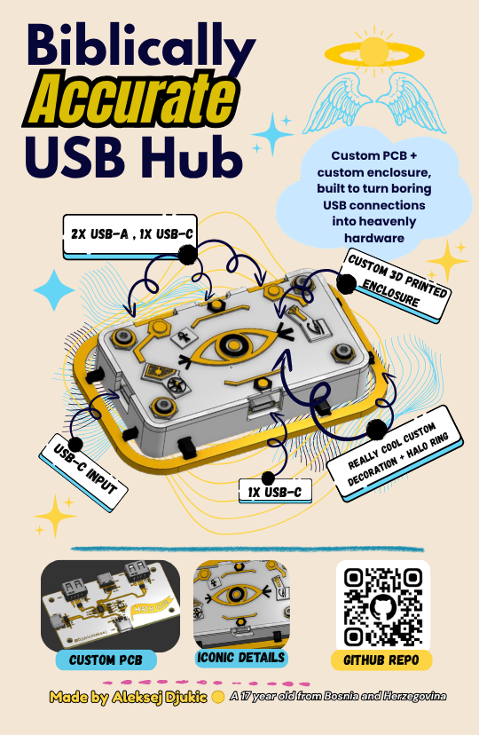

# Biblically Accurate USB Hub

  

  A compact custom USB hub wrapped in a 3D printed, angel-inspired case with layered gold-and-white details, PCB mounting posts, and a halo ring.

  <a href="Zine.pdf">Read the zine</a>
  &nbsp;|&nbsp;
  <a href="PCB%20Files/Biblically%20Accurate%20USB%20Hub%20Gerbers.zip">Download Gerbers</a>
  &nbsp;|&nbsp;
  <a href="3D%20Case%20Files/STEP%20Files">STEP case files</a>
  &nbsp;|&nbsp;
  <a href="BOM/Biblically%20Accurate%20USB%20Hub%20BOM%20Excel%20File.csv">PCB BOM</a>

---

## Overview

This project is a custom USB hub built around the SL2.1s hub controller. The board includes two USB-A connectors, three USB-C connectors, ESD protection, oscillator support, and the supporting passives needed for a clean compact hub design.
<h1 align = "center">
  Why did I build this project
</h1>

  I built this project as a part of an event called Fallout , organized by an organization called Hack Club, we ship projects and when we reach 60 hours of work on them we get invited to Shenzen, China on a Hardware Hackathon, I am building this project to work toward those 60 hours.
  <h2 align = "center">Why did I build this USB Hub?</h2>
  I created this project to deepen my understanding of how hardware works at a fundamental level, from sourcing components to designing the PCB. I also wanted to put my own custom spin on the classic USB hub by adding cool features that I would personally appreciate and use.
  My desk is really messy from all the cables I use, so I decided to make this USB Hub to help me organize my cables a bit , but also as this is my first hardware project, I thought I should start from something easier like a USB Hub and my next project will be better.

The enclosure is the dramatic part: a two-piece 3D printed case with a white top shell, gold raised details, decorative eye motifs, and a separate halo ring. The PCB sits inside the bottom shell on standoffs, and the top and bottom are fastened together with four M3 screws into heat-set inserts.

## Repository Contents

| Path | What it contains |
| --- | --- |
| [`3D Case Files/STEP Files`](3D%20Case%20Files/STEP%20Files) | Editable STEP files for the top and bottom case parts |
| [`Image Assets`](Image%20Assets) | Case renders, PCB renders, routing screenshots, schematic image, and zine image |
| [`PCB Files`](PCB%20Files) | EasyEDA project, PCB STL, and Gerber ZIP for board manufacturing |
| [`BOM`](BOM) | CSV, TXT, and XLSX versions of the PCB bill of materials |
| [`Zine.pdf`](Zine.pdf) / [`Zine.png`](Zine.png) | Project zine in PDF and image form |

## Case Gallery
<h2>
  <a href="https://cad.onshape.com/documents/cf7789123195bd5a45b065f1/w/dd1b2cdc65956b51f07bda70/e/39d78a645fa9a3d968176734?renderMode=0&uiState=6a1f0fc86f648b43c2e283e0">OnShape Project Link</a>
</h2>
| Full case | Exploded view |
| --- | --- |
|  |  |

| PCB mounting | Case without top cover |
| --- | --- |
|  |  |

## PCB Gallery

| Front render | Back render |
| --- | --- |
|  |  |

| Top routing | Bottom routing |
| --- | --- |
|  |  |

### Schematic

  

## Zine

  

## PCB BOM

The full BOM is available as [`CSV`](BOM/Biblically%20Accurate%20USB%20Hub%20BOM%20Excel%20File.csv), [`TXT`](BOM/Biblically%20Accurate%20USB%20Hub%20BOM%20Excel%20File.txt), and [`XLSX`](BOM/Biblically%20Accurate%20USB%20Hub%20BOM%20Excel%20File.xlsx). Prices below are from the included BOM file and include minimum order quantity effects where noted.

| Item | Designator | LCSC ID | Qty used | Notes | Line total |
| --- | --- | --- | ---: | --- | ---: |
| 1uF capacitor | C1, C2, C3, C5, C6, C7, C9, C11, C12 | C15849 | 9 | Minimum order quantity: 50 | $0.55 |
| 5.1k resistor | R1, R2 | C23186 | 2 | Minimum order quantity: 100 | $0.16 |
| 10.0 QHHTZB6.3 USB-A port | USB2, USB5 | C668591 | 2 | Minimum order quantity: 10 | $0.63 |
| 12MHz passive oscillating crystal | X1 | C6071564 | 1 | Minimum order quantity: 10 | $0.71 |
| 27pF capacitor | C13, C14 | C1656 | 2 | Minimum order quantity: 100 | $0.60 |
| 56k downstream resistor | R3, R4, R5, R6 | C23206 | 4 | Minimum order quantity: 100 | $0.16 |
| 100uF capacitor | C8, C10 | C108856 | 2 | Minimum order quantity: 10 | $0.82 |
| SL2.1s MCU | U1 | C2684433 | 1 | Minimum order quantity: 10 | $2.85 |
| TYPE-C 16PIN 2MD(073) USB-C port | USB1, USB3, USB4 | C2765186 | 3 | Minimum order quantity: 20 | $1.41 |
| USBLC6-2SC6 ESD protection TVS diode | D1, D2, D4, D6, D7 | C2827654 | 5 | Minimum order quantity: 10 | $0.41 |
| PCB | - | - | 5 minimum | Board order minimum | $4.00 |
| Shipping | - | - | - | Outside-EU shipping estimate from BOM | $26.00 |
| **Total** |  |  |  |  | **$38.30** |

## Build BOM

These are the extra physical assembly parts for the printed enclosure.

| Item | Quantity | Notes |
| --- | ---: | --- |
| M3 x 16mm screws | 4 | Fastens the top cover into the bottom case inserts |
| M3 heat-set inserts | 4 | Installed into the bottom case standoffs |
| 3D printing filament | About 20g+ | PLA, PETG, or similar; use white and gold if printing the separated top details |
| Finished PCB | 1 | Order from the Gerbers or modify/order from the EasyEDA project |

## How To Make One At Home

1. **Order the PCB.** Use the Gerber ZIP in [`PCB Files`](PCB%20Files) or open the EasyEDA project file if you want to inspect or modify the design first. PCBA assembly is recommended because the USB connectors and small passives are much easier to place cleanly with a board house.
2. **Print the case parts.** Export the top cover, bottom cover, and halo ring from the STEP files to your preferred slicer format, or slice the STL exports if you have them. A 0.2mm layer height works well for the enclosure; enable supports where your slicer needs them around overhangs and connector cutouts.
3. **Choose the finish.** The case is designed around a white-and-gold look. You can print the top as separate white/gold parts, print in one color and paint the raised details, or use the included CAD as a starting point for your own color split.
4. **Install the heat-set inserts.** Press four M3 heat-set inserts into the bottom case standoffs with a soldering iron set to a controlled temperature. Keep the inserts straight so the screws line up cleanly with the top cover.
5. **Seat the PCB.** Place the assembled PCB into the bottom shell and check that the USB-A and USB-C ports line up with the side openings. If a print is tight, lightly clean the cutouts before forcing the board.
6. **Close the case.** Set the top cover onto the bottom shell and secure it with four M3 x 16mm screws. Tighten gently into the inserts; snug is enough for a printed case.
7. **Test it.** Plug the hub into a computer, then test each downstream port with a simple USB device before trusting it with anything important.

## Printing Notes

- Use enough walls to keep the screw posts sturdy; 3 or more perimeters is a good starting point.
- Keep the heat-set insert holes clean. If they come out undersized, open them carefully instead of melting aggressively.
- Test-fit the PCB before final assembly, especially around the USB connector cutouts.
- The halo and raised details are decorative, so print orientation can be chosen for the cleanest visible surface.

## Inspiration

This README layout and project presentation style takes inspiration from the clear build notes and documentation in [geg-tech/biblicallyaccuratekeyboard](https://github.com/geg-tech/biblicallyaccuratekeyboard).

## License

This project is released under the [MIT License](LICENSE).
